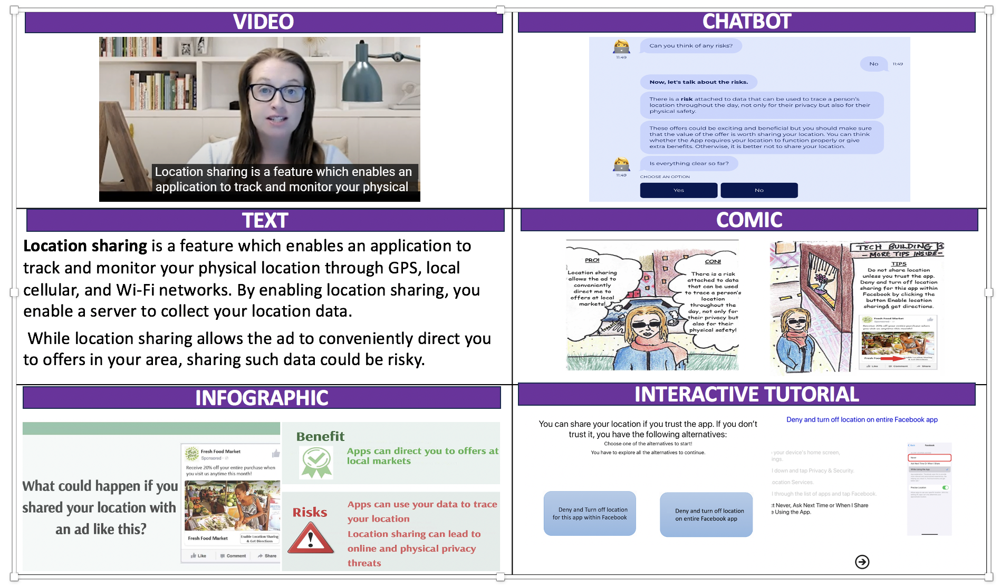

::: {.project-summary}
How can we help older adults protect their digital privacy? This project designed and evaluated online privacy education materials across multiple formats, including text, videos, infographics, interactive tutorials, comics, audio, and chatbots. The study identified key differences in learning preferences between older and younger adults to support more tailored and accessible privacy education.
:::

## Study background and purpose

Older adults increasingly use digital technologies such as social media, online services, and mobile applications to maintain social connections and participate in everyday life. However, they may also face privacy and security risks due to lower digital literacy, limited familiarity with privacy settings, and uncertainty about how online platforms collect and use personal information.

Existing privacy education tools often fail to address the needs of older adults. Many tools are too technical, too fast-paced, or insufficiently tailored to users’ learning preferences. This project aimed to design and evaluate privacy education interventions across multiple modalities to identify which formats older and younger adults find clear, engaging, and useful.

By incorporating feedback from both older and younger adults through focus groups, this study sought to develop effective, accessible, and motivating tools that help users make more informed digital privacy decisions.

## Methodology and study design

To investigate digital privacy education for older adults, we designed interventions around four privacy scenarios identified through a comprehensive literature review:

1. Managing public posts on social media
2. Controlling cookies for online tracking
3. Preventing identity theft in online transactions
4. Managing location sharing

Each scenario was implemented in seven modalities: text, video, audio, chatbot, interactive tutorial, infographic, and comic. These formats were selected to address diverse learning preferences and to compare how users respond to different types of privacy education.

{.project-full-figure fig-alt="Examples of privacy education materials presented across multiple modalities, including video, chatbot, text, comic, infographic, and interactive tutorial."}

We conducted twelve focus groups with 33 participants, including 15 older adults and 18 younger adults. This qualitative approach allowed us to explore age-related differences in privacy concerns, learning preferences, and reactions to different educational formats.

The intervention materials were designed using clear and accessible language, visual examples, practical strategies, and balanced discussions of risks and benefits. The multimodal approach enabled comparisons across formats and helped identify modality-specific strengths, weaknesses, and age-related preferences.

## Results and key findings

Through thematic analysis of focus group data, we identified generational differences in digital privacy concerns, privacy-management strategies, and preferences for privacy education.

::: {.age-box .age-box-older}
### For older adults

Older adults expressed significant privacy concerns, often due to limited confidence, prior negative experiences, and uncertainty about how to manage privacy settings. Some participants described strategies such as avoiding online platforms, seeking help from younger individuals, passively engaging with social media, or relying on default privacy settings.

- **Preferred modalities:** Videos were favored for their clarity, simplicity, step-by-step structure, and personable presentation. Many older adults found it easier to follow privacy instructions when they were demonstrated visually and verbally.

- **Challenges:** Chatbots and interactive tutorials were more difficult for some older adults because of navigation demands, uncertainty about how to form questions, or confusion about where to click. Visual-heavy formats such as infographics were sometimes perceived as distracting or overwhelming.
:::

::: {.age-box .age-box-younger}
### For younger adults

Younger adults generally reported greater confidence in managing privacy settings and described a more proactive approach to privacy tools. They were often less concerned about privacy risks and sometimes helped older adults navigate digital platforms.

- **Preferred modalities:** Chatbots and interactive tutorials were valued for their interactivity, flexibility, and ability to keep content engaging. Infographics were appreciated because they were visually appealing and easy to skim.

- **Challenges:** Videos were sometimes perceived as too slow or insufficiently engaging. Overly detailed educational content was also seen as boring or unnecessary.
:::

By synthesizing these user insights, we highlighted distinct patterns in how older and younger adults interact with privacy tools and educational materials. The findings underscore the need for tailored interventions that align with users’ specific needs, abilities, and learning preferences.

## Implications

::: {.implications-box}
This project emphasizes the importance of designing privacy education interventions that are tailored to the distinct needs and preferences of different age groups.

For older adults, privacy education should prioritize clear explanations, practical examples, step-by-step guidance, and opportunities for self-paced learning. Video and text-based materials may be especially useful when they provide concrete demonstrations and allow users to revisit information as needed.

For younger adults, privacy education may be more effective when it is concise, interactive, visually engaging, and easy to navigate. Chatbots, interactive tutorials, and infographics may be useful for supporting quick learning and active engagement.

More broadly, these findings suggest that privacy education should not be designed as a one-size-fits-all intervention. Age-inclusive privacy tools should account for differences in confidence, prior experience, cognitive load, interaction preferences, and motivation.
:::