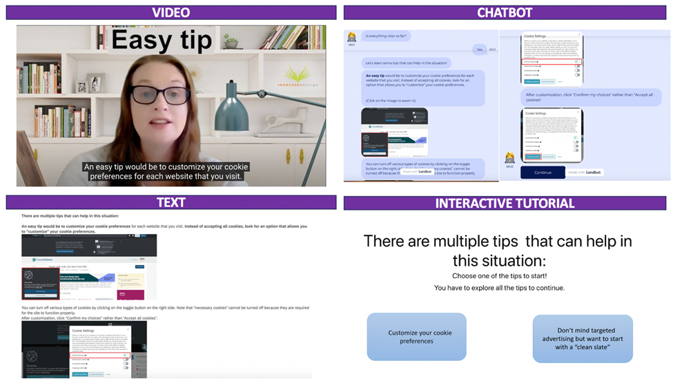
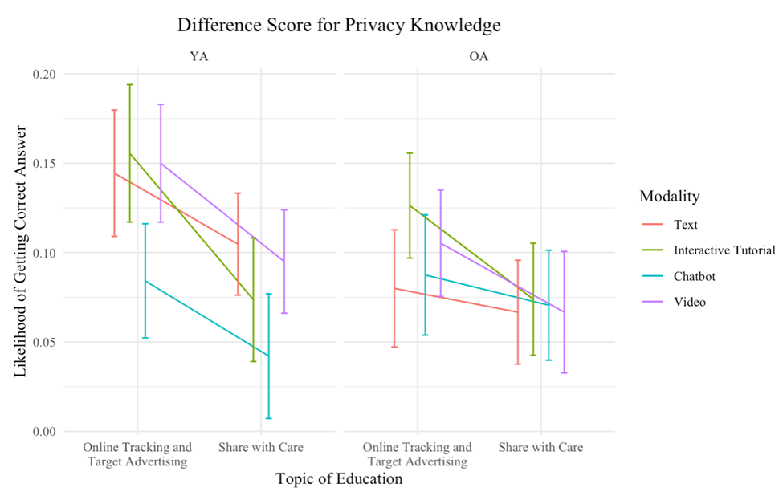
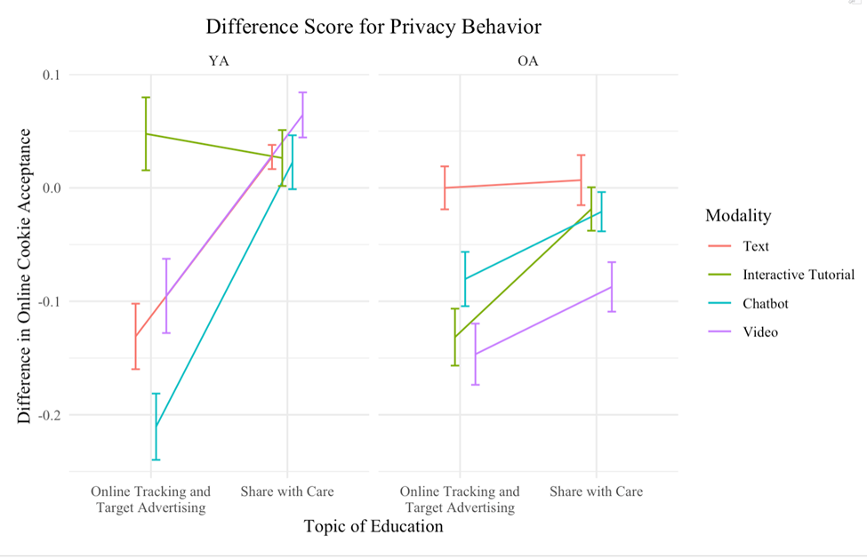

::: {.project-summary}
How can we empower people to make more informed privacy decisions online? Building on our [qualitative research](privacy-education.qmd), this project quantitatively evaluated refined online privacy education tutorials. The study assessed usability and effectiveness by measuring user satisfaction, enjoyment, perceived learning, privacy knowledge, and privacy-protective behavior across younger and older adults.
:::

## Study background and purpose

The widespread use of HTTP/online cookies for tracking raises concerns about privacy risks such as targeted advertising, behavioral profiling, and price discrimination. Although cookie consent banners are now common, many users still struggle to understand the different types of cookies and their implications for privacy.

This study examined how different privacy education modalities affect users’ privacy knowledge and behavior. Specifically, we compared text, interactive tutorial, chatbot, and video-based education materials across younger and older adults.

The goal was to evaluate whether these educational materials help users make more informed privacy decisions and whether age influences the effectiveness of different education formats. This work contributes to the design of age-tailored privacy education strategies, particularly in the context of online cookies and targeted advertising.

## Methodology and study design

This study used a repeated mixed-factor experimental design to evaluate whether privacy education materials improved users’ privacy knowledge and privacy-protective behavior.

The design included four factors:

1. **Age group:** Older adults vs. younger adults  
2. **Education topic:** Online cookies vs. social media sharing  
3. **Education modality:** Text, interactive tutorial, chatbot, or video  
4. **Time:** Pre-education vs. post-education  

Participants were randomly assigned to one of two education topics:

1. **Share with Care:** Focused on the risks of social media sharing and served as the control topic.

2. **Online Tracking and Targeted Advertising:** Focused on online cookies and served as the experimental topic.

The study evaluated whether participants improved in knowledge and behavior specifically related to HTTP/online cookies.

### Experimental manipulation

Privacy education modules were designed to introduce privacy concerns, explain key concepts, and provide actionable strategies. Half of the participants received the **Online Tracking and Targeted Advertising** module, which aligned with the study’s cookie decision-making task. The other half received the **Share with Care** module, which controlled for general exposure to privacy education.

### Privacy education modalities

Four content delivery modalities were used: **text**, **interactive tutorial**, **chatbot**, and **video**. These modalities were selected based on findings from our earlier qualitative work, where comic and infographic formats received lower usability ratings.

{.project-full-figure fig-alt="Examples of privacy education modalities including video, chatbot, text, and interactive tutorial formats."}

::: {.outcome-box}
**Outcome measures included:**

1. **Privacy knowledge:** Participants completed ten targeted knowledge questions about the assigned privacy topic. Pre- and post-education knowledge scores were compared to evaluate learning.

2. **Privacy decision-making behavior:** Participants completed a web-browsing task involving 40 simulated webpages. Among these webpages, 28 included cookie disclaimers that required participants to choose between “Accept All Cookies” and “Customize Settings.”

Both privacy knowledge and privacy behavior were measured before and after participants completed the education tutorial.
:::

## Results and key findings

We analyzed the data using generalized linear mixed-effects regression models to assess the impact of privacy education on knowledge and behavior. These models accounted for individual variability and repeated measures, including pre- and post-education responses. Simple effects models were used to examine specific interactions among age group, education topic, and delivery modality.

### Privacy knowledge

::: {.project-two-col}

::: {.project-text}
The privacy education modules successfully improved participants’ knowledge about online cookies and targeted advertising.

Improvements in privacy knowledge were generally consistent across education modalities and age groups. This suggests that the materials were effective in conveying conceptual privacy knowledge regardless of whether they were presented through text, interactive tutorial, chatbot, or video formats.
:::

::: {.project-side-image}
{.project-figure fig-alt="Line graph showing difference scores for privacy knowledge across age groups and education modalities."}
:::

:::

::: {.knowledge-box}
**Key finding for privacy knowledge:**  
Privacy education improved participants’ conceptual understanding of online cookies and targeted advertising across both younger and older adults. Knowledge gains were relatively consistent across text, interactive tutorial, chatbot, and video modalities.
:::

### Privacy behavior

Participants also demonstrated more privacy-conscious behavior after completing the education module, including increased use of “Customize Settings” when encountering cookie disclaimers.

However, behavioral improvements varied by both age group and education modality.

::: {.project-two-col}

::: {.project-text}
Younger adults showed the greatest behavioral improvement when privacy education was delivered through chatbot and text modalities.

In contrast, interactive tutorials and video appeared to be more effective for older adults. These findings suggest that the most effective privacy education format may depend on users’ age, interaction preferences, and comfort with different digital learning tools.
:::

::: {.project-side-image}
{.project-figure fig-alt="Line graph showing difference scores for privacy behavior across age groups and education modalities."}
:::

:::

::: {.behavior-box}
**Key finding for privacy behavior:**

1. Participants made more privacy-protective decisions after completing the education module.

2. Younger adults benefited most from chatbot and text-based education.

3. Older adults benefited most from interactive tutorial and video-based education.

4. These differences suggest that privacy education should be tailored by age group and delivery modality rather than designed as a one-size-fits-all intervention.
:::

## Implications

::: {.implications-box}
This study provides actionable insights for designing effective and inclusive privacy education tools.

**Age-centered design:**  
Knowledge and behavioral improvements varied across age groups and modalities, underscoring the importance of tailoring privacy education to users’ needs, preferences, and cognitive strengths.

**Modality matters:**  
For younger users, conversational interfaces such as chatbots may support engagement and behavior change. For older users, structured interactive tutorials and videos may provide clearer guidance and better support.

**Privacy-centered interaction design:**  
The increased use of “Customize Settings” after education suggests that well-designed educational materials can help users make more privacy-protective choices. Privacy interfaces may benefit from embedded educational moments, such as short explanations, dynamic help features, or tutorial overlays.

**Adaptive privacy education:**  
The different effects of modality by age group highlight the value of user research in identifying barriers and preferences. Future systems could recommend privacy education formats based on user profiles, accessibility needs, or prior experience.

Overall, these findings suggest that organizations can improve privacy education by designing tools that are age-inclusive, modality-sensitive, and closely connected to the privacy decisions users encounter in real digital environments.
:::