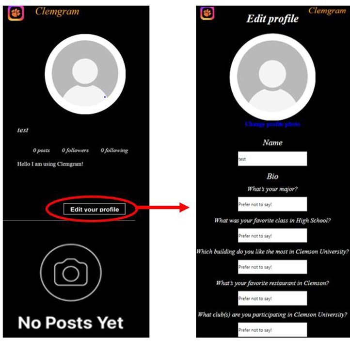
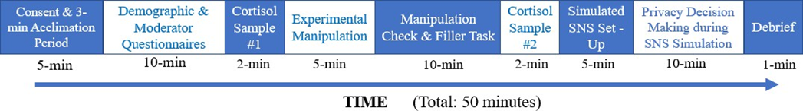
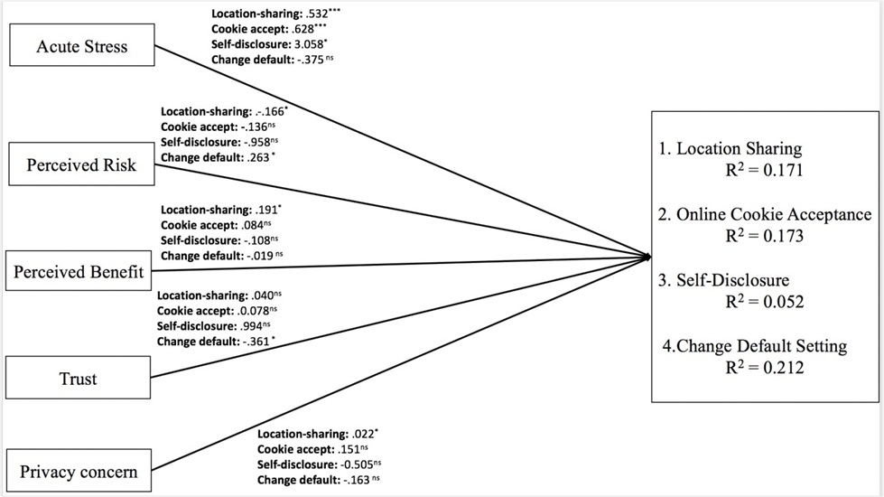

::: {.project-summary}
How does acute stress affect the way people protect their online privacy? This project examined how acute stress influences privacy decisions in a controlled experiment, offering evidence for how psychological states can shape digital behavior and informing the design of user-centered privacy solutions.
:::

## Study background and purpose

The psychological literature has established that stress can impair decision-making by increasing risk-taking behavior, decreasing sensitivity to potential losses, and disrupting cognitive processing through premature closure and nonsystematic scanning. These effects can lead to impulsive or poorly informed choices.

Despite stress being a common part of daily life, its impact on privacy-related decisions remains underexplored. This study examined whether acute stress changes privacy decision-making in the context of social networking sites. By investigating the psychological mechanisms involved, this project contributes to a better understanding of privacy behavior and informs strategies for promoting more privacy-conscious decisions.

## Methodology and study design

::: {.project-two-col}

::: {.project-text}
We employed a between-subject experimental design with two groups. In the experimental group, stress was induced using the [Socially Evaluated Cold-Pressor Task (SECPT)](https://doi.org/10.1016/j.psyneuen.2018.03.010). Participants submerged their right hand in 0–4°C ice water for up to three minutes while being recorded on camera, under the pretense that their facial expressions would be analyzed.

In the control group, participants submerged their hand in lukewarm water for three minutes without video recording. Salivary cortisol samples were collected and analyzed to confirm successful stress induction.
:::

::: {.project-side-image}
{.project-figure}
:::

:::

We created a simulated social media platform, **Clemgram**, modeled after Instagram, to measure privacy decisions. Participants created an account, set up their profile, made a post with sensitive content, navigated advertisements, customized cookie settings, and chose location-sharing preferences.

::: {.measure-box}
**Privacy decision measures included:**

1. **Default privacy settings:** Changing a post’s visibility from “Anyone” to “Close friends only.”

2. **Cookie management:** Choosing to “Accept All Cookies” or customize cookie settings on three webpages.

3. **Location sharing:** Enabling or disabling location sharing for three webpages.

4. **Information disclosure:** Self-reported willingness to share personal information about finances, personality, and body image.
:::

{.project-full-figure}

## Results and key findings

::: {.project-two-col}

::: {.project-text}
Multi-group structural equation modeling was performed using the `lavaan` package in RStudio and Mplus. The findings showed that participants exposed to acute stress made riskier privacy decisions compared to participants in the control condition.

These results suggest that stress can shift privacy behavior toward convenience-oriented choices, especially when users are asked to make privacy decisions in unfamiliar or cognitively demanding online environments.
:::

::: {.project-side-image}
{.project-figure}
:::

:::

::: {.findings-box}
**Participants exposed to acute stress were:**

1. More likely to enable location sharing on unfamiliar webpages.

2. More likely to choose “Accept All Cookies” on unfamiliar webpages.

3. Less likely to change default privacy settings from “Anyone can see” to “Close friends only” when posting sensitive content.

4. More willing to share personal information on social media.

**These behavioral measures were conducted after experimental (stress) manipulation**
:::

## Implications

::: {.implications-box}
This study highlights the role of user stress in privacy decision-making. Under acute stress, users may prioritize immediate convenience over privacy protection, increasing their vulnerability to risks such as unwanted data disclosure, tracking, and targeted advertising.

These findings suggest that privacy interfaces should account for users’ cognitive and emotional states. Stress-aware interface design could include protective defaults, simplified choices, clearer privacy prompts, and decision aids that reduce cognitive effort. For example, systems could pre-select privacy-protective options, reduce unnecessary prompts, or provide brief explanations at moments when users are likely to make risky decisions.

More broadly, this work supports the development of human-centered privacy systems that are not only transparent, but also sensitive to the cognitive burden users experience in real-world digital environments.
:::